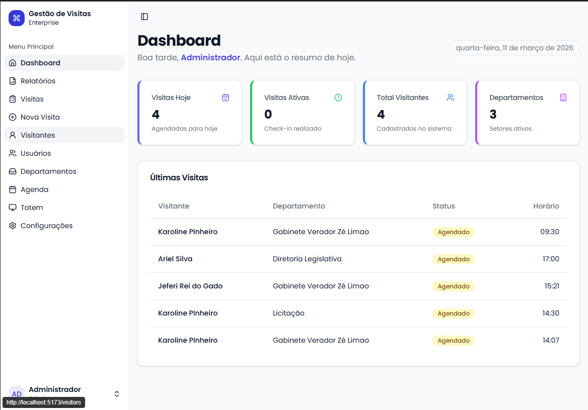
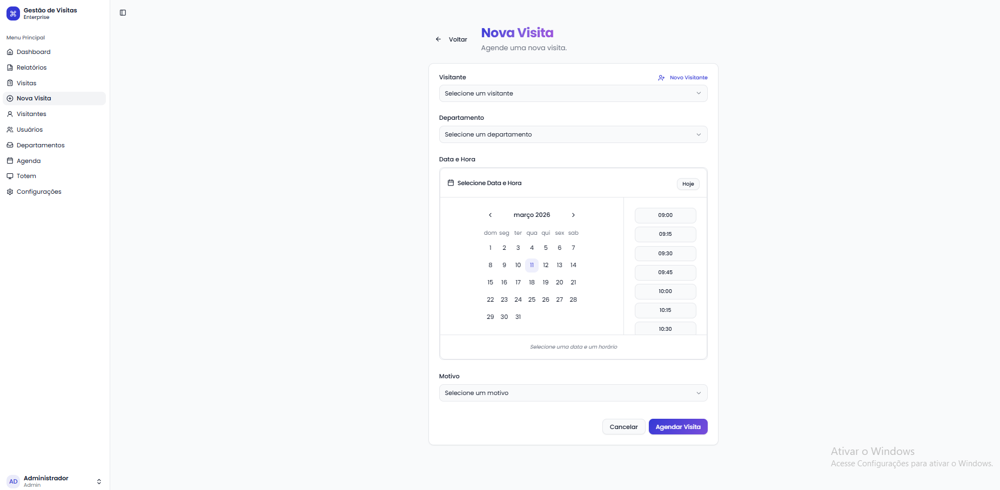
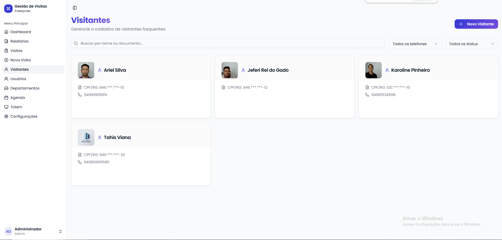
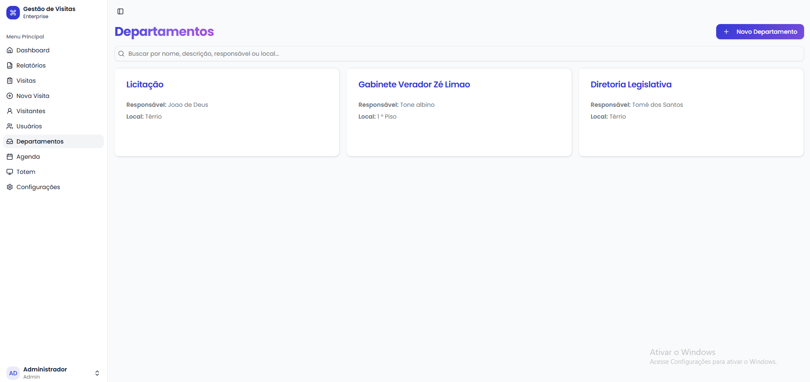
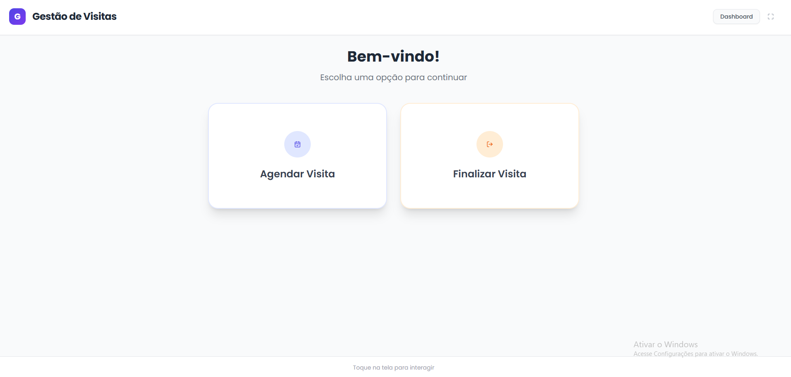

# Gestão de Visitas

Aplicação web completa para gestão de visitantes, com portal administrativo e totem de autoatendimento.

## Visão Geral
- **Frontend**: React + Vite + Tailwind + Radix (workspace `frontend`).
- **Backend**: Node.js (Express) + Prisma + PostgreSQL (workspace `backend`).
- **Banco**: PostgreSQL (variáveis em `backend/.env`).
- **Autenticação**: JWT.
- **Reconhecimento facial**: face-api.js no totem com fallback para CPF.

## Funcionalidades
- Cadastro e gestão de visitantes, usuários e departamentos.
- Registro de visitas com check-in/check-out, código de acesso e PDF rápido.
- Totem de autoatendimento com reconhecimento facial.
- Relatórios e estatísticas.

## Pré-requisitos
- Node.js 22+
- npm 10+
- PostgreSQL em `localhost:5433` (ajuste em `backend/.env`).

## Execução rápida
```bash
# instalar dependências (workspaces)
npm install

# backend (porta 3000)
npm run dev:backend

# frontend (porta 5173/5174)
npm run dev:frontend
```
Credenciais seed: `admin@gestao.com` / `admin123`.

## Estrutura
- `backend/` – API, Prisma e migrações.
- `frontend/` – SPA (admin + totem).
- `docs/screenshots/` – capturas usadas abaixo.

## Módulos & Screenshots
- **Dashboard** – visão geral de visitas e indicadores.  
  
- **Gestão de Visitas** – listagem, filtros, check-in/out e PDF.  
  
- **Nova Visita** – criação rápida com seleção de visitante/host.  
  
- **Visitantes** – cards com foto, edição e embeddings faciais.  
  
- **Departamentos** – setores e responsáveis.  
  
- **Gestão de Usuários** – perfis e permissões.  
  
- **Agenda (lista/calendário)** – visão temporal das visitas.  
    
  
- **Totem** – fluxo de reconhecimento facial + fallback CPF.  
  

## Reconhecimento Facial
- Embeddings salvos em `Visitor.faceEmbedding` (face-api.js).
- Visitantes antigos precisam gerar embedding (recarregar foto ou script).
- Fallback para CPF permanece disponível no totem.

## Scripts úteis
- `npm run dev:backend` – API com hot reload.
- `npm run dev:frontend` – SPA/totem com HMR.
- `npm run build` – build de ambos workspaces.
- `npx prisma studio --schema backend/prisma/schema.prisma` – UI do banco.

## Segurança e Privacidade
- Uso de dados biométricos requer consentimento (`consentGiven`).
- Atualize a política de privacidade conforme o uso de reconhecimento facial.

## Roadmap curto
- Relatórios PDF server-side.
- Threshold configurável e logs de confiança no matching facial.
- Armazenamento de fotos/embeddings em storage externo com CDN.
